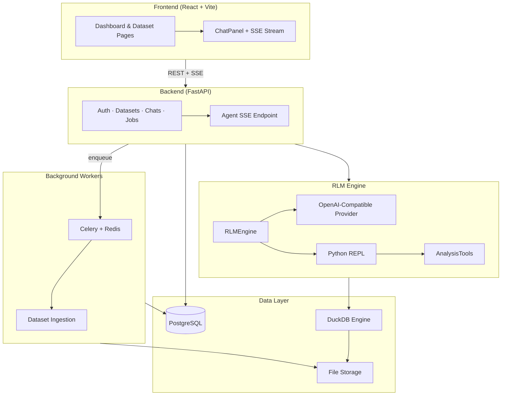
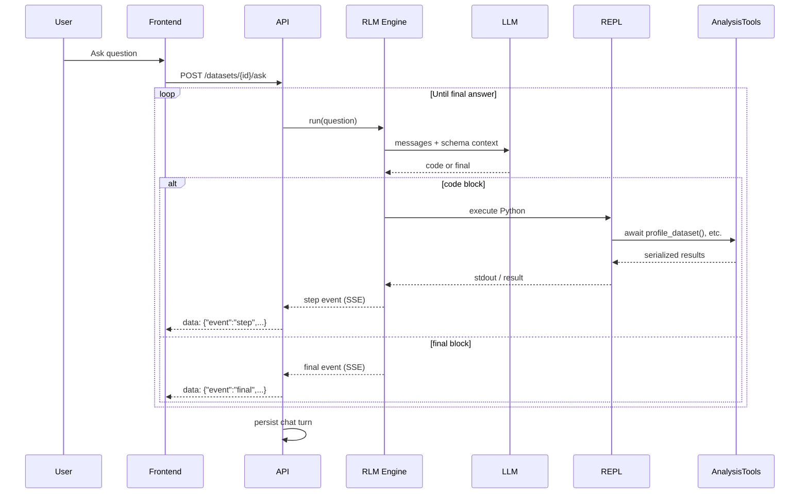

# RLM Data Agent

An AI-powered data analysis workspace. Upload CSV or Excel files, ask questions in plain language, and watch a **Recursive Language Model (RLM)** agent inspect your data, write Python, run analytical tools, and stream its reasoning back to you in real time.

```text
┌─────────────────────────────────────────────────────────────────────────┐
│                         RLM Data Agent                                  │
│                                                                         │
│   Upload dataset  ──►  Ingest & profile  ──►  Ask in natural language │
│                                                    │                    │
│                                                    ▼                    │
│                              LLM writes Python ──► REPL executes tools  │
│                                                    │                    │
│                                                    ▼                    │
│                              Stream steps ◄── DuckDB + Analysis layer   │
└─────────────────────────────────────────────────────────────────────────┘
```

## Features

### Dataset workspace
- **Upload CSV and XLSX** files up to 500 MB with drag-and-drop
- **Async ingestion** via Celery — schema detection, row/column counts, and encoding handling run in the background
- **Live progress** tracking while datasets move from pending → processing → ready
- **Schema explorer** with column names, types, and dataset statistics on every dataset page

### RLM analysis agent
- **Natural-language Q&A** over your uploaded data — no SQL or Python required from the user
- **Recursive reasoning loop** — the agent inspects data, forms hypotheses, runs tools, and iterates until it has evidence for an answer
- **Sandboxed Python REPL** — the LLM executes code against a controlled tool namespace, never touching raw files directly
- **Rich analytical toolkit** including profiling, aggregations, correlations, time series, anomaly detection, and data quality reports
- **Server-Sent Events (SSE)** streaming so you see each reasoning step, code block, and tool result as they happen

### Chat & history
- **Per-dataset chat sessions** with full conversation history
- **Run logs panel** showing agent steps, token usage, and iteration counts
- **Step timeline** visualizing the agent's thought process across iterations

### Platform
- **JWT authentication** with register/login and protected routes
- **Multi-tenant isolation** — every dataset, job, and chat session is scoped to the authenticated user
- **OpenAI-compatible LLM** support (LM Studio, vLLM, OpenAI, etc.) via configurable base URL and model
- **Modern UI** built with React 19, Tailwind CSS 4, and shadcn/ui with light/dark theme support

## Architecture at a glance



For a deeper dive, see [docs/ARCHITECTURE.md](docs/ARCHITECTURE.md).

## Tech stack

| Layer | Technologies |
|-------|-------------|
| Frontend | React 19, TypeScript, Vite, TanStack Query, React Router, Tailwind CSS 4, shadcn/ui |
| Backend | FastAPI, SQLAlchemy 2 (async), Alembic, Pydantic Settings |
| Agent | Custom RLM engine, OpenAI-compatible provider, sandboxed REPL |
| Analytics | DuckDB, Pandas, Polars, custom statistics/aggregation/anomaly engines |
| Infrastructure | PostgreSQL, Redis, Celery, structlog |
| Auth | JWT (PyJWT), bcrypt |

## Project structure

```text
RLM Agent/
├── backend/
│   ├── src/backend/
│   │   ├── api/v1/          # REST + SSE endpoints
│   │   ├── rlm/             # RLM engine, REPL, tools, prompts
│   │   ├── analysis/        # Statistics, aggregations, anomalies, quality
│   │   ├── data_runtime/    # DuckDB engine, CSV/Excel sources
│   │   ├── services/        # Business logic (agent, datasets, auth, chats)
│   │   ├── workers/         # Celery tasks (ingestion)
│   │   └── db/              # SQLAlchemy models & session
│   ├── migrations/          # Alembic migrations
│   └── docker-compose.yml   # Redis for Celery
├── frontend/
│   └── src/
│       ├── pages/           # Dashboard, Dataset, Login
│       ├── components/      # Agent chat, dataset UI, layout
│       ├── hooks/           # useAgentStream, useDatasets, useAuth
│       └── api/             # Typed API client
└── docs/
    ├── ARCHITECTURE.md      # System design deep dive
    └── GETTING_STARTED.md   # Setup & configuration
```

## Quick start

See [docs/GETTING_STARTED.md](docs/GETTING_STARTED.md) for full setup instructions. The short version:

```bash
# 1. Start Redis (for Celery)
cd backend && docker compose up -d

# 2. Backend
cd backend
cp .env.example .env   # configure DATABASE_URL, JWT_SECRET_KEY, LLM settings
uv sync
alembic upgrade head
uv run celery -A backend.workers.celery_app worker --loglevel=info &
uv run backend          # http://localhost:8000

# 3. Frontend
cd frontend
npm install
npm run dev             # http://localhost:5173
```

Configure your LLM in `backend/.env`:

```env
LLM_BASE_URL=http://localhost:1234/v1
LLM_API_KEY=lm-studio
LLM_MODEL=your-model-name
```

## API overview

| Method | Endpoint | Description |
|--------|----------|-------------|
| `POST` | `/api/v1/auth/register` | Create account |
| `POST` | `/api/v1/auth/login` | Get JWT token |
| `GET` | `/api/v1/datasets` | List your datasets |
| `POST` | `/api/v1/datasets` | Upload CSV/XLSX |
| `POST` | `/api/v1/datasets/{id}/ask` | Ask the agent (SSE stream) |
| `GET` | `/api/v1/datasets/{id}/sessions` | List chat sessions |
| `GET` | `/api/v1/jobs/{id}` | Poll ingestion job status |

Interactive API docs are available at `http://localhost:8000/docs` when the backend is running.

## How the agent works

The RLM (Recursive Language Model) pattern keeps the LLM in a tight loop:

1. The user asks a question about a ready dataset.
2. The engine sends the question plus dataset schema context to the LLM.
3. The LLM responds with either `<code>...</code>` (Python to run) or `<final>...</final>` (the answer).
4. Code runs in a sandboxed REPL with access to `AnalysisTools` — never raw file I/O.
5. Tool output is fed back to the LLM for the next iteration.
6. Steps stream to the frontend via SSE; the final answer and full run log are persisted to the chat session.



## Documentation

- [Architecture](docs/ARCHITECTURE.md) — layers, data flow, module boundaries, security
- [Getting Started](docs/GETTING_STARTED.md) — prerequisites, env vars, running all services

## License

Private project — all rights reserved.
