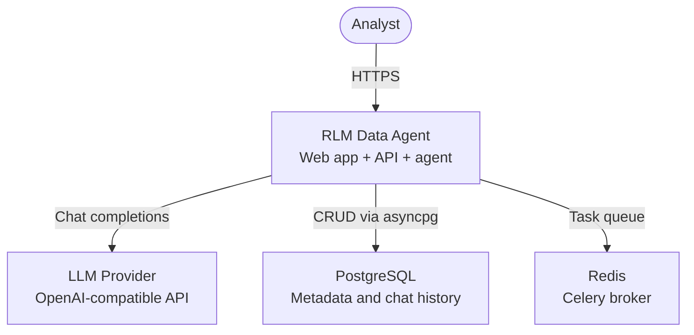
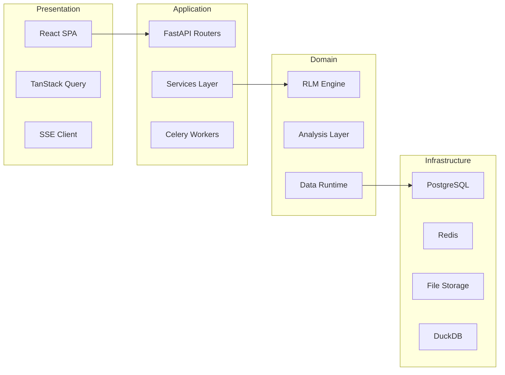
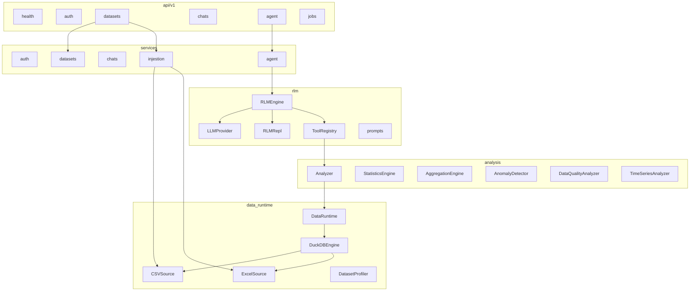
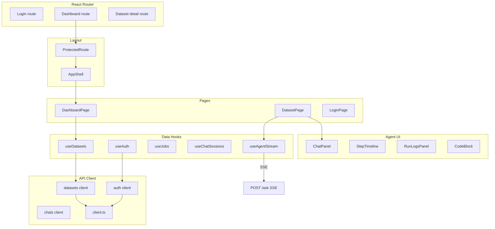
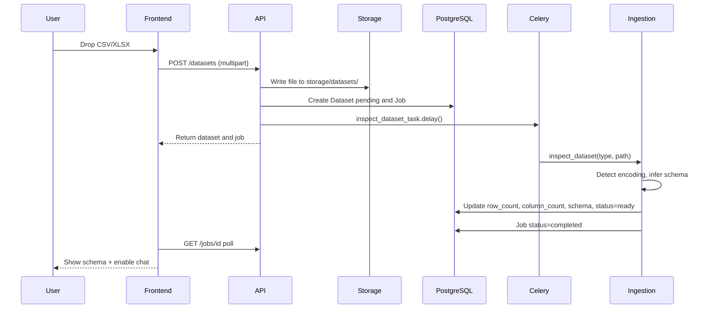
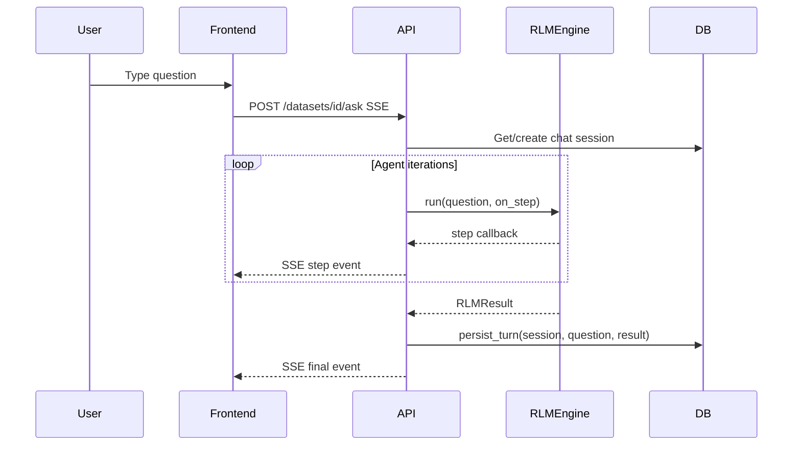
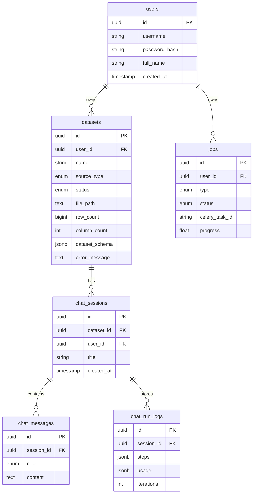

# Architecture

This document describes the system design of **RLM Data Agent** — how components connect, where boundaries are drawn, and how data flows from upload to answer.

## Design principles

1. **The LLM never touches raw data.** All file access goes through `DataRuntime` → `AnalysisTools` → sandboxed REPL. The agent can only call approved async functions.
2. **Separation of transport, compute, and storage.** FastAPI handles HTTP/SSE; Celery handles ingestion; DuckDB handles analytical queries; PostgreSQL handles metadata and chat history.
3. **Streaming-first UX.** Agent steps are pushed over SSE so users see progress instead of waiting for a blocking response.
4. **User isolation.** Every query is scoped by `user_id` — datasets, jobs, sessions, and chat messages belong to one user.

---

## System overview



---

## Layered architecture



| Layer | Responsibility | Key modules |
|-------|---------------|-------------|
| **Presentation** | UI, routing, auth state, streaming consumption | `frontend/src/pages`, `hooks/useAgentStream.ts` |
| **Application** | HTTP contracts, orchestration, background jobs | `backend/api`, `backend/services`, `backend/workers` |
| **Domain** | Agent loop, analytics, query execution | `backend/rlm`, `backend/analysis`, `backend/data_runtime` |
| **Infrastructure** | Persistence, queues, files | PostgreSQL, Redis, `storage/datasets/` |

---

## Backend modules



### `api/v1` — HTTP surface

Thin routers that validate input, enforce auth, and delegate to services. The agent router is special: it returns a `StreamingResponse` with `text/event-stream` media type.

### `services` — orchestration

Business logic that composes domain objects. `run_agent()` is the key entry point:

1. Build a `DataRuntime` from the dataset file path
2. Wrap it in `AnalysisTools` + `ToolRegistry`
3. Create an `OpenAICompatibleProvider` from settings
4. Run `RLMEngine.run()` and always close the runtime in `finally`

### `rlm` — Recursive Language Model

The core agent loop:

```text
┌──────────────────────────────────────────────────────────┐
│                      RLMEngine.run()                     │
│                                                          │
│  ┌─────────┐    ┌─────────┐    ┌─────────────────────┐ │
│  │ System  │    │  User   │    │ Assistant turns     │ │
│  │ prompt  │ +  │ question│ +  │ (code results, etc.)│ │
│  └─────────┘    └─────────┘    └─────────────────────┘ │
│                          │                               │
│                          ▼                               │
│                   LLMProvider.chat()                     │
│                          │                               │
│              ┌───────────┴───────────┐                   │
│              ▼                       ▼                   │
│         <code>...</code>      <final>...</final>       │
│              │                       │                   │
│              ▼                       └──► RLMResult     │
│         RLMRepl.exec()                                   │
│              │                                           │
│              ▼                                           │
│    ToolRegistry namespace                                │
│    (await profile_dataset(), etc.)                       │
└──────────────────────────────────────────────────────────┘
```

**`RLMRepl`** — Executes Python in a restricted namespace. Only registered tool callables and safe builtins are available. Output is truncated to prevent context explosion.

**`ToolRegistry`** — Binds `AnalysisTools` methods into the REPL namespace and records each tool invocation in a `RunCollector` for the run log.

**`RunCollector`** — Captures steps (LLM turns, code execution, tool calls, errors) for streaming and persistence.

### `analysis` — analytical domain

`Analyzer` is the high-level analysis facade over `DataRuntime`. It provides:

- Column-level statistics and full dataset analysis
- Filtering, aggregation, correlation
- Time series decomposition
- Anomaly detection (z-score, IQR)
- Data quality scoring

`AnalysisTools` exposes a curated subset of these capabilities to the RLM — the agent cannot run arbitrary SQL or access the filesystem.

### `data_runtime` — data access

Abstraction over data sources with a uniform interface:

```text
DataSource (ABC)
    ├── CSVSource      ──► DuckDB read_csv with encoding detection
    ├── ExcelSource    ──► DuckDB / pandas bridge
    └── DatabaseSource ──► (future) direct DB connections

DataRuntime
    ├── schema()       ──► column names, dtypes, row count
    ├── sample(n)      ──► preview rows
    ├── query(sql)     ──► read-only SQL with forbidden-keyword guard
    └── to_dataframe() ──► Pandas DataFrame for analysis layer
```

**DuckDB** is the execution engine — it handles large CSVs efficiently in-process without loading everything into memory upfront.

**Safety:** `DataRuntime.query()` rejects SQL containing `DROP`, `DELETE`, `INSERT`, `UPDATE`, and other mutating keywords.

---

## Frontend architecture



### Streaming agent responses

`useAgentStream` consumes the SSE endpoint:

```text
POST /api/v1/datasets/{id}/ask
Content-Type: application/json
Authorization: Bearer <token>

{"question": "...", "session_id": "..."}

─── response (text/event-stream) ───

data: {"event":"step","type":"code","content":"...","iteration":1}
data: {"event":"step","type":"repl_output","content":"...","iteration":1}
data: {"event":"final","answer":"...","iterations":3,"usage":{...}}
```

The hook parses each `data:` line, updates local step state for the timeline, and commits the final answer to the chat panel.

### State management

- **TanStack Query** — server state (datasets, jobs, chat sessions) with caching and refetch
- **Local React state** — streaming steps, upload progress, UI toggles
- **localStorage** — JWT token via `lib/auth.ts`

---

## Data flow

### Upload & ingestion



### Ask question



---

## Database schema



---

## Security model

| Concern | Implementation |
|---------|---------------|
| Authentication | JWT bearer tokens, bcrypt password hashing |
| Authorization | All dataset/chat endpoints filter by `current_user.id` |
| Agent sandbox | REPL namespace limited to registered tools; no file I/O |
| SQL safety | Read-only queries; forbidden keyword blocklist |
| Upload limits | Configurable max file size (default 500 MB); extension allowlist |
| CORS | Configurable origins (default `http://localhost:5173`) |

Secrets (`JWT_SECRET_KEY`, `LLM_API_KEY`, `DATABASE_URL`) are loaded from `backend/.env` via Pydantic Settings and never committed to the repository.

---

## Analytical tools available to the agent

The LLM can call these functions inside the REPL (all async):

| Tool | Purpose |
|------|---------|
| `profile_dataset()` | High-level column profiles |
| `get_columns()` | Column names and dtypes |
| `count()` | Total row count |
| `sample(n)` | Random sample rows |
| `value_counts(column)` | Top value frequencies |
| `describe()` | Statistical summary of all columns |
| `describe_column(column)` | Detailed stats for one column |
| `filter_rows(expression)` | Filter with pandas-style expressions |
| `analyze()` | Full column-by-column analysis |
| `quality_report()` | Data quality assessment |
| `correlation(method)` | Correlation matrix |
| `percentiles(column, values)` | Percentile calculations |
| `aggregate(group_by, aggregations)` | Group-by aggregations |
| `timeseries(date_col, value_col)` | Time series analysis |
| `detect_anomalies(column)` | Z-score or IQR anomaly detection |

---

## Extension points

| Area | How to extend |
|------|--------------|
| New file formats | Implement `DataSource` + register in `factory.py` |
| New analysis | Add method to `Analyzer`, expose via `AnalysisTools`, document in `prompts.py` |
| New LLM provider | Implement `LLMProvider` protocol |
| Database sources | Extend `DatabaseSource` in `data_runtime/sources/` |
| Background jobs | Add Celery task in `workers/tasks/` |

---

## Observability

- **structlog** — structured JSON logging across API and workers
- **RunCollector** — per-agent-run step log persisted to `chat_run_logs`
- **OpenTelemetry** — API dependencies included; instrumentation can be wired in `main.py`

---

## Related docs

- [Getting Started](GETTING_STARTED.md) — run the full stack locally
- [README](../README.md) — project overview and quick reference
